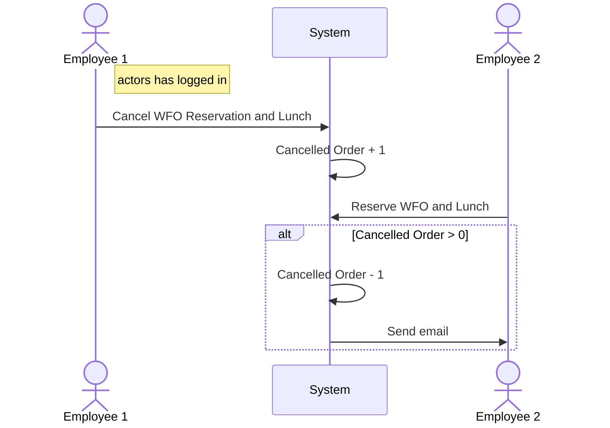

## Flow: Queue Cancellation System
Action happened after deadline time for lunch order (04:00 PM)

```mermaid
sequenceDiagram
    actor E as Employee 1
    participant S as System
    actor E1 as Employee 2 

    Note right of E: actors has logged in

    E->>S: Cancel WFO Reservation and Lunch
    
    S->>S: Cancelled Order + 1
    
    E1->>S: Reserve WFO and Lunch
    alt Cancelled Order > 0
        S->>S: Cancelled Order - 1
        S->>E1: Send email
    end 
```
   