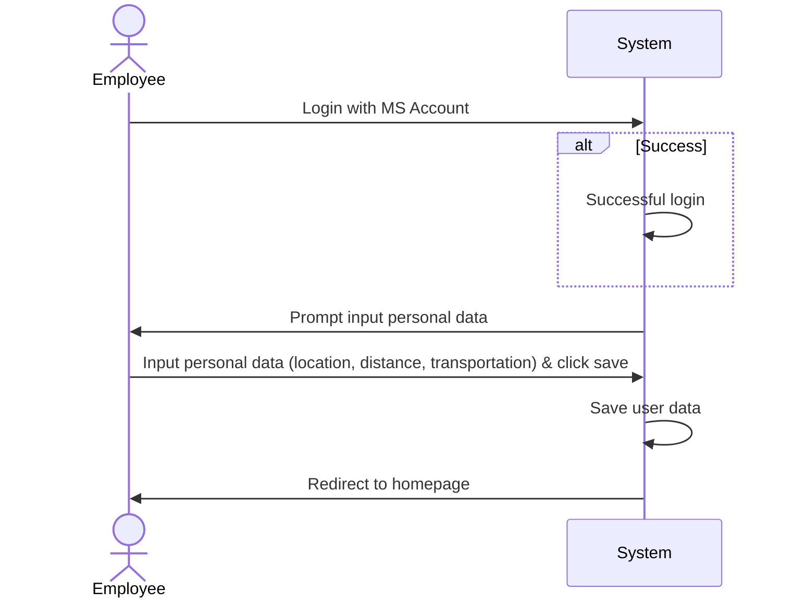
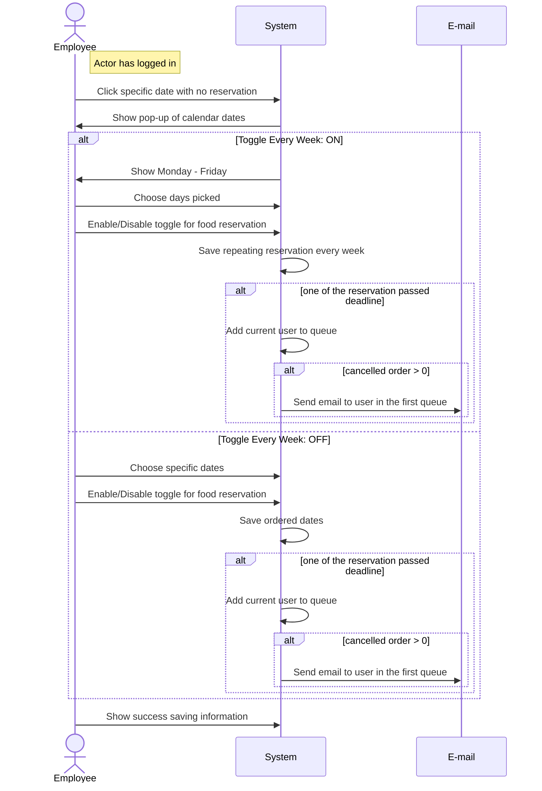
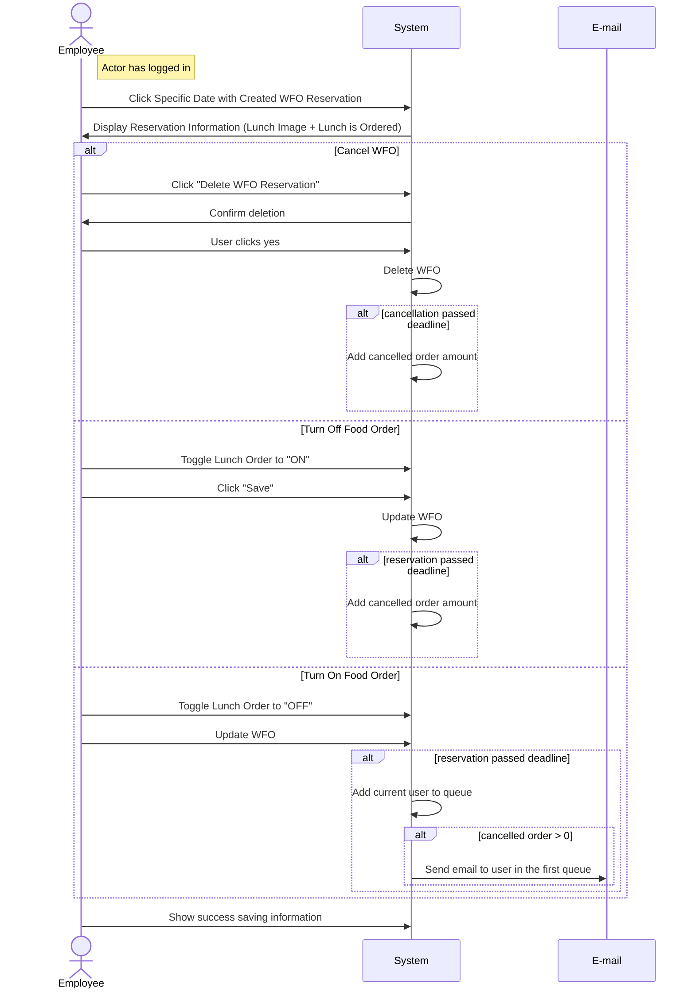
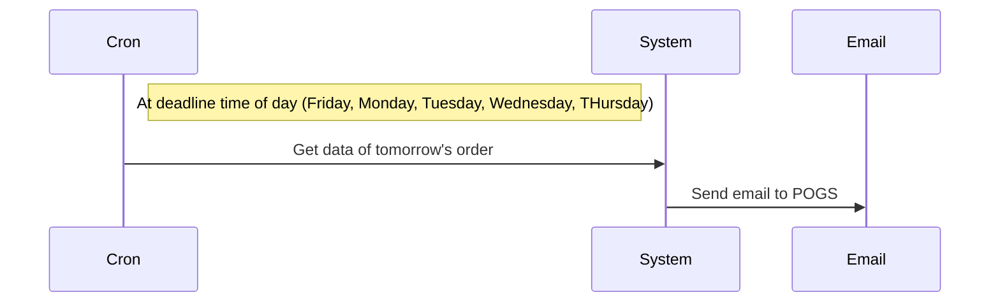
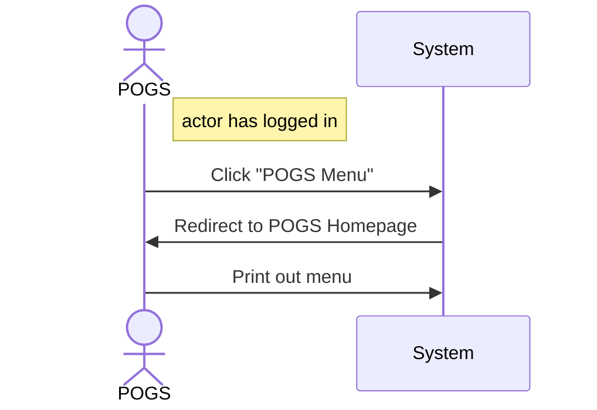
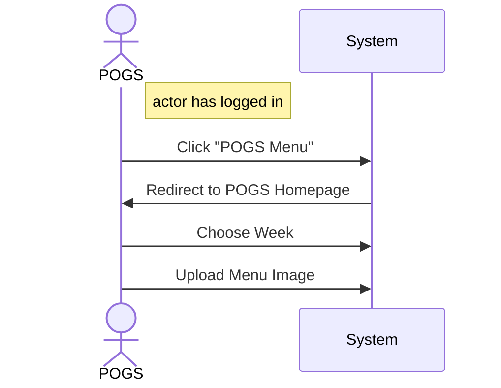

## Flow: Employee Registration

```mermaid
sequenceDiagram
    actor E as Employee 
    participant S as System

    E->>S: Login with MS Account
    alt Success
        S->>S: Successful login
    end
    S->>E: Prompt input personal data
    E->>S: Input personal data (location, distance, transportation) & click save
    S->>S: Save user data
    S->>E: Redirect to homepage
```
   

## Flow: Reserve WFO

```mermaid
sequenceDiagram
    actor E as Employee 
    participant S as System
    participant EM as E-mail

    Note Right of E: Actor has logged in

    E->>S: Click specific date with no reservation
    S->>E: Show pop-up of calendar dates
    alt Toggle Every Week: ON
        S->>E: Show Monday - Friday
        E->>S: Choose days picked
        E->>S: Enable/Disable toggle for food reservation
        S->>S: Save repeating reservation every week
        alt one of the reservation passed deadline
            S->>S: Add current user to queue
            alt cancelled order > 0
                S->>EM: Send email to user in the first queue 
            end 
        end
    else Toggle Every Week: OFF
        E->>S: Choose specific dates
        E->>S: Enable/Disable toggle for food reservation
        S->>S: Save ordered dates
        alt one of the reservation passed deadline
            S->>S: Add current user to queue
            alt cancelled order > 0
                S->>EM: Send email to user in the first queue 
            end 
        end
    end
    E->>S: Show success saving information
```
   

## Flow: Cancel WFO Reservation

```mermaid
sequenceDiagram
    actor E as Employee 
    participant S as System
    participant EM as E-mail

    Note Right of E: Actor has logged in

    E->>S: Click Specific Date with Created WFO Reservation
    S->>E: Display Reservation Information (Lunch Image + Lunch is Ordered)

    alt Cancel WFO
        E->>S: Click "Delete WFO Reservation"
        S->>E: Confirm deletion
        E->>S: User clicks yes

        S->>S: Delete WFO
        alt cancellation passed deadline
            S->>S: Add cancelled order amount
        end
        
    else Turn Off Food Order
        E->>S: Toggle Lunch Order to "ON"
        E->>S: Click "Save"
        
        S->>S: Update WFO
        alt reservation passed deadline
            S->>S: Add cancelled order amount
        end

    else Turn On Food Order
        E->>S: Toggle Lunch Order to "OFF"
        E->>S: Update WFO
        alt reservation passed deadline
            S->>S: Add current user to queue
            alt cancelled order > 0
                S->>EM: Send email to user in the first queue 
            end 
        end
    end
    E->>S: Show success saving information
```
   

## Flow Cut Off Date

```mermaid
sequenceDiagram
    participant C as Cron
    participant S as System
    participant EM as Email

    Note right of C: At deadline time of day (Friday, Monday, Tuesday, Wednesday, THursday)
    C->>S: Get data of tomorrow's order
    S->>EM: Send email to POGS
```
   

## Flow Reporting

```mermaid
sequenceDiagram
    actor P as POGS 
    participant S as System
    Note right of P: actor has logged in

    P->>S: Click "POGS Menu"
    S->>P: Redirect to POGS Homepage

    P->>S: Print out menu
```
   

## Flow Upload Menu

```mermaid
sequenceDiagram
    actor P as POGS 
    participant S as System
    Note right of P: actor has logged in

    P->>S: Click "POGS Menu"
    S->>P: Redirect to POGS Homepage

    P->>S: Choose Week
    P->>S: Upload Menu Image
```
   